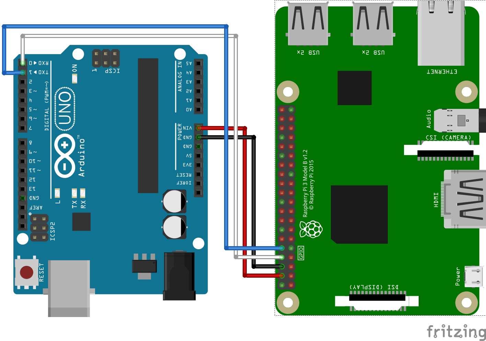

# Connect Raspberry Pi 3 to Arduino Uno
How to connect a Raspberry Pi 3 with an Arduino Uno board.

## Arduino

Load sketch.ino

## Connection



## Raspberry Pi
Enable serial port on raspi-config.

```
pip3 install pyserial
sudo chmod 777 /dev/serial0
```